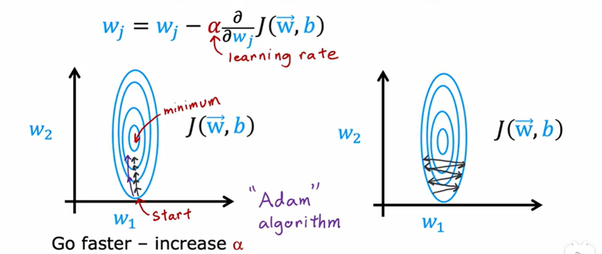

# 高级优化方法

对于学习率较小的情况 可以进行动态调整使得学习率动态变化

使梯度下降更平滑的进行

## Adam:Adaptive Moment estimation
特点：为模型的每个参数使用不同的学习率
每个w有一个α  b有一个α
### 简单来说
如果学习率一直在同一方向梯度下降则增大学习率α
如果学习率一直保持震荡则减小学习率α
对你选择的学习率更具鲁棒性（但也可以适当调整参数）
可以加快梯度下降

### 实现方案
```
model.compile(optimizer=tf.keras.optimizers.Adam(learning_rate=1e-3),
loss=tf.keras.losses.SparseCategoricalCrossentropy(from_logits=True))

model.fit(X,Y,epochs=100)
```