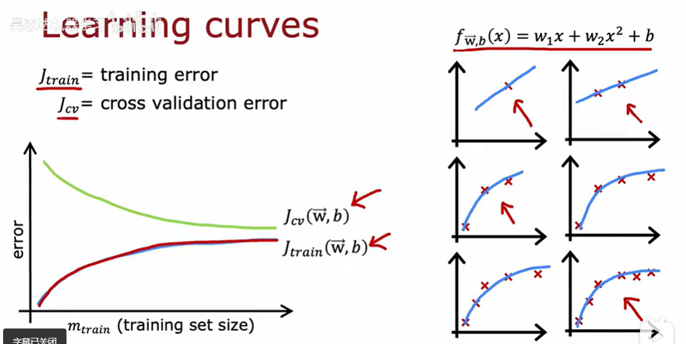

# 诊断偏差和方差

高偏差 则欠拟合  
高方差 则过拟合  
判断方法：查看算法在训练集和交叉验证集的表现

高方差的典型标志：Jcv很高 相比于Jtrain （过拟合）
我们要做的就是比Jtrain和Jcv
如果Jtrain不高 Jcv也不高 则说明算法模型适用于该场景
  
**使用正则化非常重要！**

## 随着lambda变化的训练误差和交叉验证误差 

## 建立表现基准
判断Jtrain和Jcv与机器学习算法
看看训练误差与人类表现水平相比是否相差较大

假定：人类表现是基线水平  
训练误差Jtrain  
交叉验证误差Jcv  
则训练误差与基线水平如果很大 则高bias  
Jtrain与Jcv相差很大  则高方差  
如果基线水平远大于Jtrain和Jcv 但Jtrain和Jcv差不多则high bias
**高偏差和高方差可以同时存在**

## 学习曲线
帮助理解学习算法在不同数据量下的表现,学习曲线对于算法与模型的调优很重要

也就是说对于训练集的增大，训练误差会越来越大，交叉验证误差会越来越小

_对于一个高bias的模型，即便你增加再多训练数据，也不可能对数据的训练误差有比较大的影响_

_在进行大范围数据收集之前，要先检查学习算法是否有较高的偏差_

_当基准表现在训练误差与交叉验证误差之间时且二者有一点差值时，可以说明增大数据集可以进一步缩小误差_

## 偏差或方差与神经网络
关键词：**神经网络**
如果把神经网络做的足够大 则对于数据集有很好的拟合性  
也就是说：**_大型神经网络在小或中等数据集上的表现很好_**

关键点：
1、只要你适当正则化，使用更大的神经网络几乎不会有任何坏处。更大的网络会使算法变慢，但不影响性能
2、只要训练集不是太大，那么尤其是较大的神经网络通常是低偏差的，适合复杂函数拟合，主要处理的是高方差问题