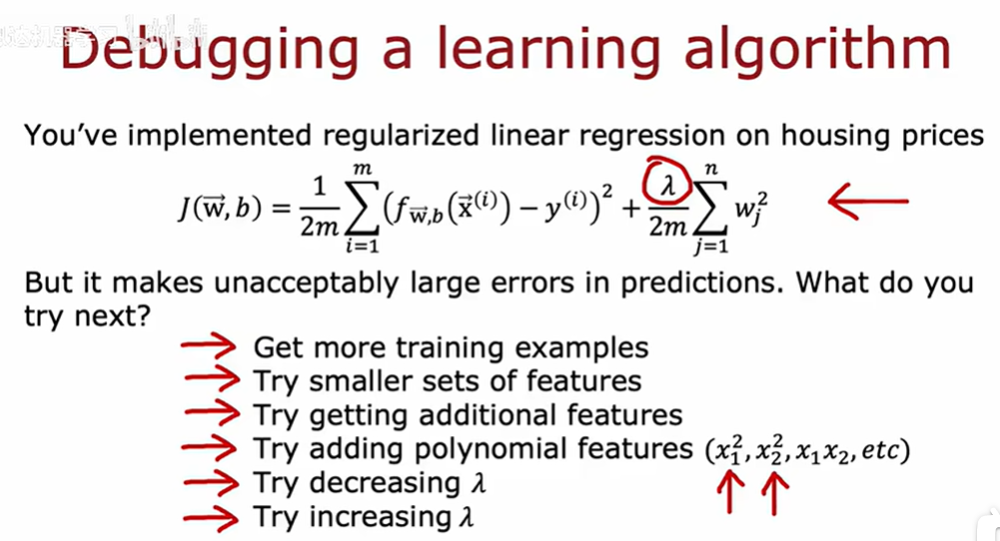
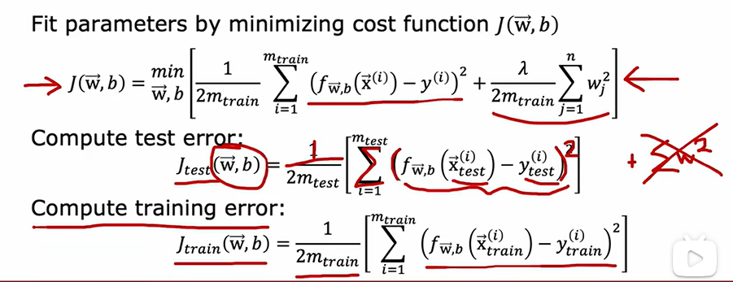
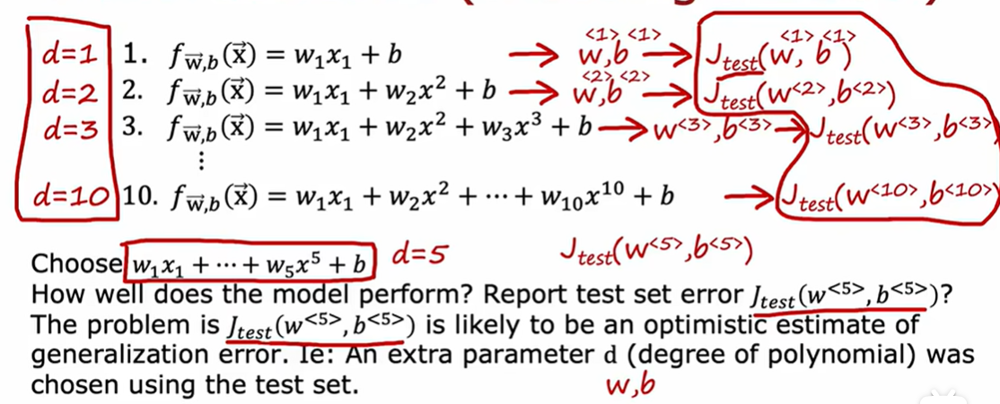
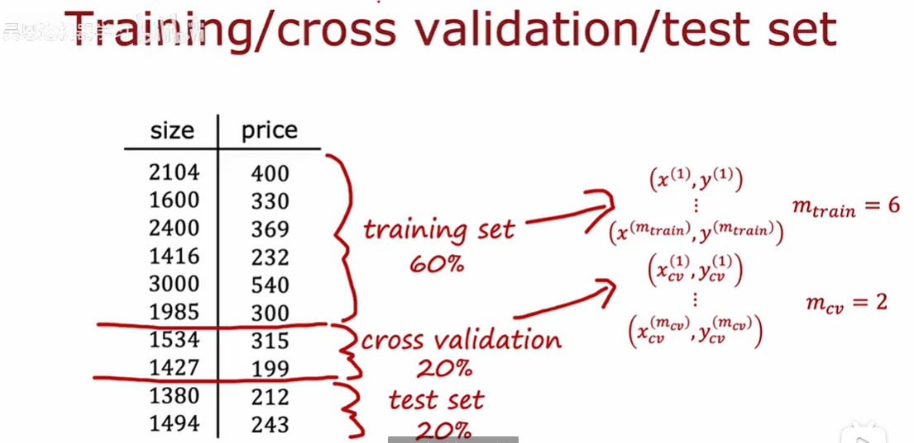

# 构建算法

上述给出了不同情况下的算法差异

[toc]
## 使用测试集评估模型性能

选取一部分数据集作为training set
另一小部分作为test set 
通常来说training set的大小要大于test set

对于评估时的计算  与成本函数J稍有不同
这里的test与training均没有正则化项 而是直接的进行测评
将会导致jtrain接近零  但是曲线波动很大  有过拟合风险  有一些样本与实际严重不符
----->导致 jtest结果很好，但是模型没有很好的泛化能力

## 选择适合机器学习算法的模型

使用测试集来为特定的机器学习选择模型：
有以下模型多项式拟合的选择：

需要注意的时，当用其中的一个d值来进行拟合的时候，拟合的误差总会低于实际误差，因为数据集的限制使得我们不可能完美的估计数据情况
所以上述是有误差存在的，实际中并不推荐使用
更可能是下面这种情况:
通过选择不同的模型
不再分为两个子集而是三个自己
比如一下方式:

分为了训练集  交叉验证集（验证集） 测试集
然后：分别对所有模型进行验证，验证过程为：
使用训练集拟合出每个模型的w和b，
然后计算每个模型的J函数，这个过程要在交叉验证集上进行，而不是测试集，选出参数d（即模型）
观察哪个模型交叉验证误差J最低，则说明哪个模型对其拟合较好
而后：我们要对其进行验证
### 因为我们没有进行任何的参数拟合到测试集，所以Jtest是对模型的泛化误差的公平且不过与乐观的估计
这是我们公平选择模型的方式：既不要用测试集对模型做任何决定
