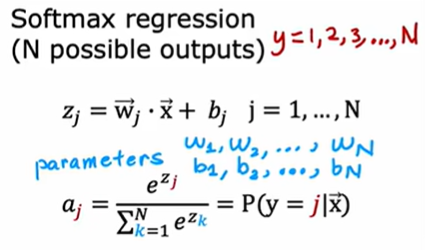
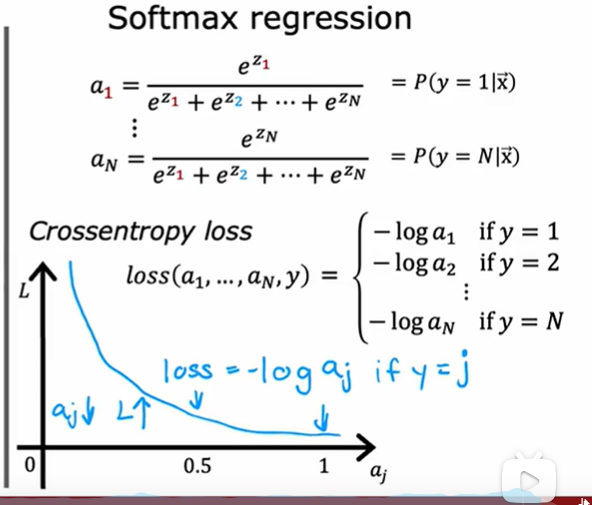

# softmax函数  本质用于多类问题
[toc]
## softmax计算:
 

多个类的概率总和为1   softmax是逻辑回归的广义形式
对于sigmoid函数   上下同乘e^x次方  即为二元的一般逻辑回归形式


## 指定softmax代价函数：

 

 ### loss分段时，对其进行分段梯度下降，即softmax中的分段


 ## 神经网络的softmax输出
 改变了输出层的函数  增加单元为分类个数，分别计算各个概率


# softmax的改进实现

## 减少数字误差
对于逻辑回归：计算loss函数，先计算输出激活，然后用gz计算loss-->二进制交叉熵损失计算底层代码
如果按照一层层计算会有精度损失，但是如果直接告诉tensorflow最终运算，则tensorflow会找到一个合适的方案去进行运算使精度更好

``` 
model.compile(loss=BinaryCrossEntropy(from_logits=True))
```
该方法可以使输出层设置为仅使用线性激活函数，并同时放置激活函数和交叉熵损失到此处的loss函数规范中    (from_logits=True)的作用


## 应用到softmax回归
如果分为两步计算，则会损失精度。指定一步计算则tensorflow会自动优化计算方式从而使数值更加精确
`原理是减少过大数或者过小数的出现从而提高运算精度`

所以在输出层中，我们只使用线性激活函数
```
pre:model.compile(loss=SparseCategoricalCrossentropy())
now:model.compile(loss=SparseCrossEntropy(from_logits=True))
```
所有的损失只在损失函数中捕获
需要注意的是，上述两种写法等效，但是第二种的数值计算比第一种要更精确
因为神经网络不再使用softmax激活函数  而是linear线性激活函数 所以不再输出a1~a10 而是输出z1~z10

```
model:
model = Sequential([
    Dense(units=25,activation='sigmoid‘),
    Dense(units=15,activation='sigmoid'),
    Dense(units=1,activation='linear'),  
    此处的softmax改为linear,units改为1.这里是二分类最终用sigmoid转化
])

loss:
model.compile(loss=SparseCategoricalCrossentropy())
model.fit(X,Y,epochs=100)

fit:
logit = model(X)

predict:
f_x = tf.nn.sigmoid(logit)
```


# 多分类问题和多标签问题
多标签不是互斥的，多个量可能表示不同的含义

但是多分类是互斥的，所有分类的和概率为1